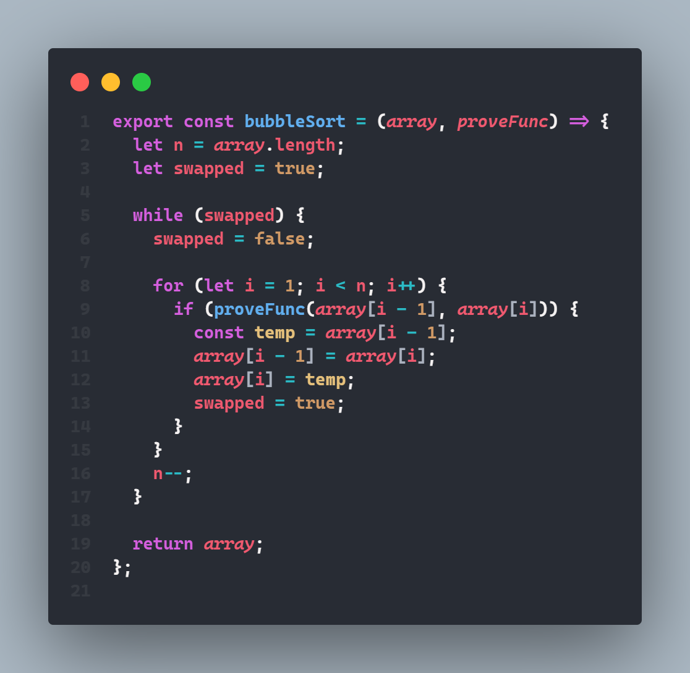
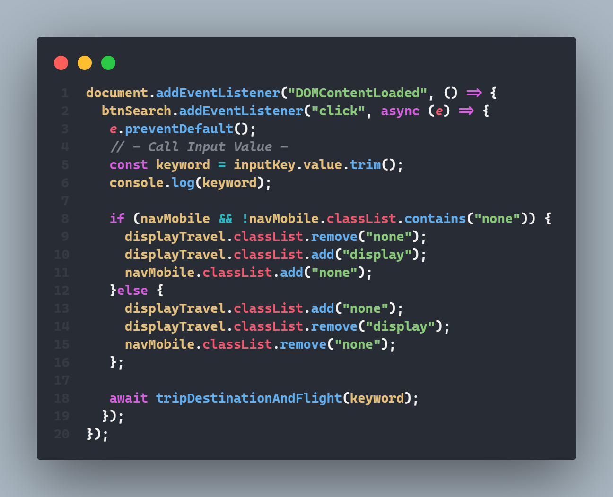
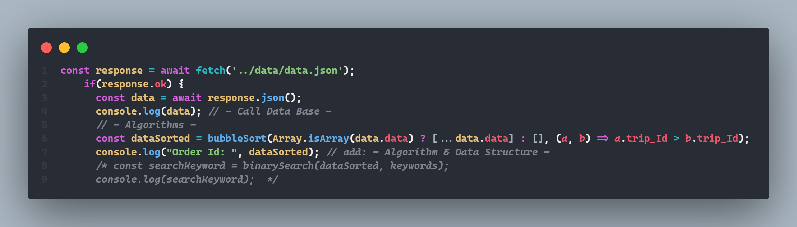
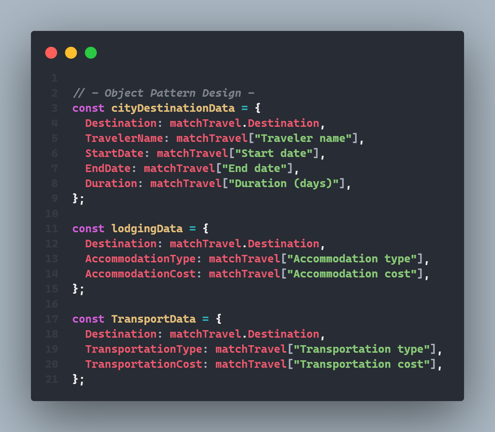
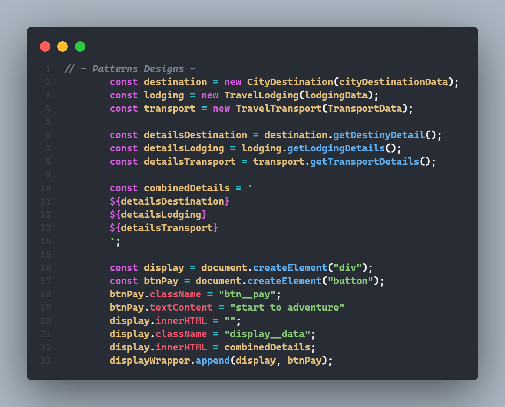
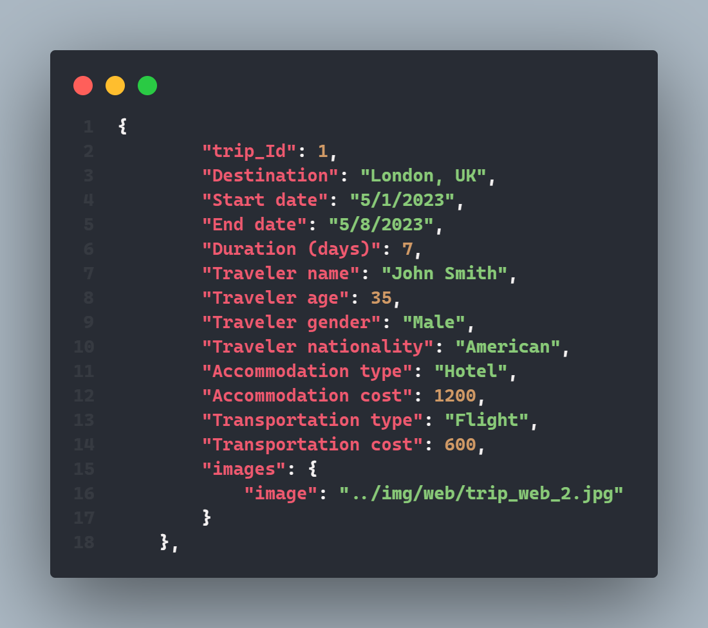
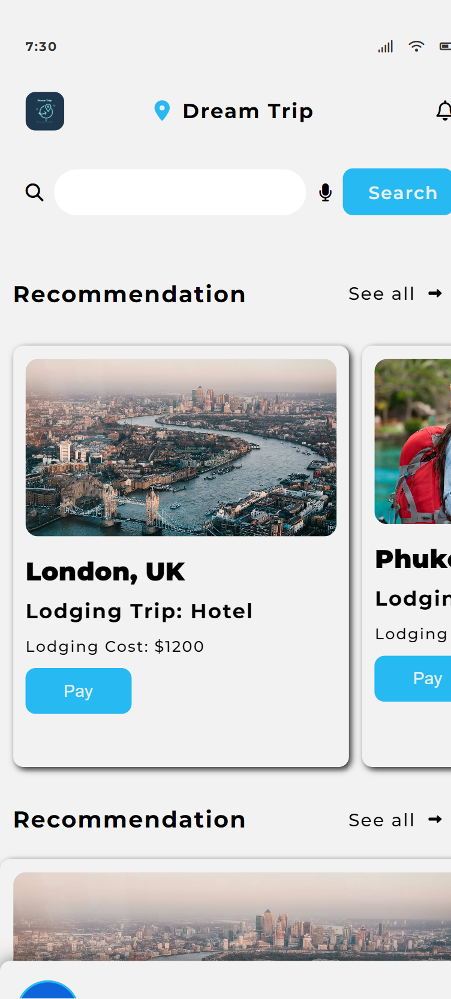

# website_spa

Creating a Single Page Application Website with Javascript Vanilla, ViteJs, Express, Node Js and CSS.Testing with Jest.Application of Algorithms, Patterns Designs and Data Structure Basic. 

## Tools Project (Design, Pattern Design, Algorithms, Testing, API Create and More...)

> Vite Js

[Vite](https://vitejs.dev/)

> Express Js

[Express](https://expressjs.com/)

> Jest (Testing)

[Jest](https://jestjs.io/)

> Eslint (Code & Testing)

[Eslint](https://eslint.org/docs/latest/use/getting-started)

> Adobe Express and Firefly (Edit Img and Create Img IA)

[adobe_express](https://www.adobe.com/es/express/)

[adobe_firefly](https://firefly.adobe.com/)

> Algorithms & Pattern Designs

[algorithms_js](https://www.30secondsofcode.org/js/algorithm/p/1/)

[pattern_design](https://refactoring.guru/es/design-patterns/catalog)

> Google Fonts

[Google_fonts](https://fonts.google.com/)

### Project Code Travel Single Web Application

### Creating a Single Web Application Travel. For this Project used Algorithms, Pattern Designs, Structure of Dates, Data Base

> Use a Patterns Design ( Factory Pattern )

> To this project I add a pattern design for call and create  new instances of code (DOM) that call at my Data Base (JSON). All these process used only with one Design Pattern (Factory Pattern)


> Used Algorithms for this project: Bubble Sort, BinarySearch and MergeSort

> To this Project I used BubbleSort to order my structure data Travel and used MergeSort to better to the expereince of user (Big O notation). Besides, I use BinarySearch for search in my Data Base




> Use Modules Imports (Node Modules)

```javascript
import { bubbleSort } from "../algorithm/algorithms.js";
import { CityDestination, TravelLodging, TravelTransport } from "../poo/patternsDesign.js";
import { displayHome } from "./pages/home.js";
import { tripDisplay } from "./pages/trip.js";
```

> Use Display in my Events for my project (System of Navigation between Sections)



> Use Function to call and Search in my Data Travel. Call my Data and my Pattern Design and ALgorithms for create my Object and used in my Project







> Data Base (First Data)



> Project Images (Responsive Design: Mobile and Desktop)


